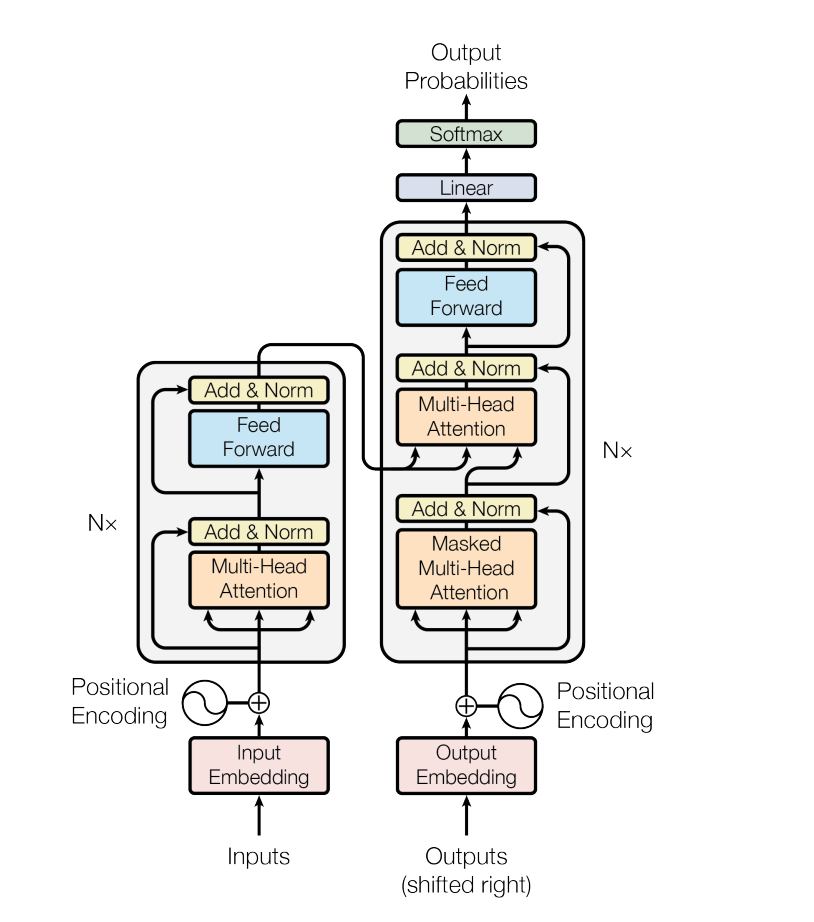

# AI 对话背后的核心技术 Transformer

本节内容我们来聊一聊 AI 界的"超级英雄" - Transformer 架构。不要被这个听起来很高大上的名字吓到，其实它背后的原理并不复杂。

## 为什么需要 Transformer

在深度学习领域，传统的序列处理模型（如 RNN、LSTM）在处理长序列时存在两个主要问题：

- 无法并行计算，导致训练效率低下
- 对长距离依赖关系的捕捉能力有限

在自然语言处理等任务中，准确理解上下文的语义关联至关重要。Transformer 架构通过自注意力机制（Self-Attention）解决了这些问题，它可以建立序列中任意位置元素之间的关系，同时支持并行计算，极大地提升了模型的性能和训练效率。

想象一下，你把英文句子翻译成中文，如果一个词一个词的翻译，最后翻译出来的句子可能会驴唇不对马嘴。所以，我们需要理解整个上下文，才能准确翻译。

比如 "bank" 这个词：

- "I went to the bank to withdraw money" (这里是"银行"的意思)
- "I sat by the river bank" (这里是"河岸"的意思)

## Transformer 的完整架构



> 架构图来自原论文 [Attention Is All You Need](https://arxiv.org/pdf/1706.03762)

Transformer 主要由以下几个部分组成：

- 词向量编码（Word Embedding）
- 位置编码（Positional Encoding）
- 多头注意力机制（Multi-Head Attention）
- 前馈神经网络（Feed Forward Neural Network）
- 残差连接（Residual Connection）和层归一化（Layer Normalization）

接下来我们慢慢拆解这个架构，看看它到底是怎么工作的。

### 词向量编码（Word Embedding）

在开始处理之前，我们需要先将文字转换成计算机能理解的数字，这就是词向量的作用了。

常见的词向量编码方式有：

#### One-Hot 编码

One-Hot 编码是将每个词表示为一个向量，向量长度等于词表大小，对应词的位置为 1，其他位置为 0。

例如，在词表 ["我", "你", "他"] 中，"我" 表示为 [1,0,0]，"你" 表示为 [0,1,0]，"他" 表示为 [0,0,1]。这种编码方式简单直观，但存在维度过大、向量稀疏等问题。

#### Word2Vec

Word2Vec 是一种通过神经网络学习词向量的方法，它通过分析词的上下文来学习词的语义表示。其基本思想是相似语境下出现的词，其含义可能相近。

Word2Vec 有两种主要的训练模型：

- CBOW (Continuous Bag of Words)：用上下文词预测中心词，例如："The [?] is shining" 中预测 "sun"。

- kip-gram：用中心词预测上下文词，例如：用 "sun" 预测 ["The", "is", "shining"]。

Word2Vec 的优势：

- 词向量具有语义性：相似词的向量距离相近
- 支持词向量运算，例如：cat - animal + human ≈ person
- 解决了 One-Hot 编码的稀疏性问题

#### 位置编码（Positional Encoding）

由于 Transformer 是并行处理的，我们不知道词的位置，假设有一个句子原本的词顺序是："我 喜欢 吃 樱桃"，Transformer 会同时看到这四个词，但它无法知道 "我" 在 "喜欢" 之前，"吃" 在 "喜欢" 之后。

这就像把一个句子的词都打散了，失去了语序信息，想象你在看一本书，每个词的位置都很重要。比如："我打他" 和 "他打我" 意思完全相反。

所以，我们需要给每个词加上一个位置标签，这就是位置编码的作用。例如：

```txt
第一个词的标签是 [0.0, 1.0, 0.0, 1.0, ...]
第二个词的标签是 [0.1, 0.9, 0.2, 0.8, ...]
第三个词的标签是 [0.2, 0.8, 0.4, 0.6, ...]
...
```

这些标签有几个特点：

- 唯一性：每个位置的标签都不一样
- 可学习：相近位置的标签数值相近
- 无限性：理论上可以处理任意长度的文本

具体实现方式：

- 使用正弦函数 sin(x) 生成奇数位置的编码
- 使用余弦函数 cos(x) 生成偶数位置的编码
- 使用不同的频率，确保每个位置都有独特的组合

### 注意力机制（Attention）

这是 Transformer 最核心的创新，它通过三个向量实现：

- **Query (查询向量)**：当前词想要知道什么
- **Key (键向量)**：其他词的特征是什么
- **Value (值向量)**：其他词携带的实际信息

我们举个例子来理解这三个向量：

想象你在图书馆找书。你脑海中有一个问题（Query）："我想找一本关于人工智能的书"。图书馆的每本书都有标签（Key），比如"深度学习"、"人工智能导论"等。通过比较你的问题和这些标签的相关性，来找到相似度最高的书。这些书的具体内容就是 Value。

具体来说：

- 如果你查询"人工智能"（Query）
- 书架上有《深度学习》（Key1）、《烹饪入门》（Key2）、《人工智能导论》（Key3）
- 通过计算相关性，系统会发现：
  - 《人工智能导论》的相关性最高（比如 0.9）
  - 《深度学习》次之（比如 0.6）
  - 《烹饪入门》相关性很低（比如 0.1）
- 最后根据这些相关性权重来组合这些书的内容（Value）

计算过程：

1. Query 和 Key 做点积，得到相关性分数
2. 通过 Softmax 归一化分数
3. 用归一化后的分数对 Value 进行加权求和

### 多头注意力（Multi-head Attention）

由于单个注意力机制可能会忽略一些重要信息，所以我们引入了多头注意力机制。

多头注意力的工作方式：

1. 将输入向量分别投影到多个子空间（通常是 8 个头）
2. 每个头独立计算注意力
3. 最后将所有头的结果拼接并线性变换

比如：翻译 "The animal didn't cross the street because it was too tired"。

- 头 1：关注 "it" 和 "animal" 的关系
- 头 2：关注 "tired" 和 "cross" 的关系
- 头 3：关注时态信息
- ...以此类推

### 前馈神经网络（Feed Forward Neural Network）

前馈神经网络作用是对每个位置的特征进行独立处理和转换。可以把它想象成一个信息加工厂，其基本结构为：

- 两个线性变换层
- 中间有一个 ReLU 激活函数
- 数学表示：FFN(x) = max(0, xW₁ + b₁)W₂ + b₂

假设，我们在翻译 "I love you" 这句话：

- 注意力层已经处理了词之间的关系
- 前馈网络负责对每个词的特征进行深入处理
- 每个词独立进行处理，不会互相影响

### 残差连接（Residual Connection）和层归一化（Layer Normalization）

在 Transformer 中，残差连接和层归一化是两个重要的"辅助工具"，它们帮助模型更好地学习和训练。这两个工具的组合使用，就像是给模型配备了：

- 高速公路（残差连接）：保证信息快速传递
- 交通规则（层归一化）：保持数据的规范性

#### 残差连接（Residual Connection）

残差连接就像是给神经网络修建了一条"快速通道"。想象你在开车：

- 主干道：需要经过多个红绿灯（神经网络的深层处理）
- 快速通道：直接到达目的地（跳过部分处理）

举个例子：

1. 输入：一个句子 "我喜欢吃苹果"
2. 主干道：经过复杂的特征提取
3. 快速通道：保留原始信息
4. 最后：把两条路的信息加在一起

这样做的好处是：

- 防止信息在传递过程中丢失
- 让深层网络更容易训练
- 解决梯度消失问题

#### 层归一化（Layer Normalization）

层归一化就像是给数据做"标准化处理"，其作用是：

- 加快训练速度
- 提高模型稳定性
- 防止数据"跑偏"

例如，我们在处理一段文字：

- "我" 的特征值是 [100, 2, 300]
- "喜欢" 的特征值是 [0.1, 0.2, 0.3]
- 这种数值差异太大，不利于模型学习

使用归一化处理数值差异太大的问题，过程如下：

- 计算平均值和方差
- 将数据调整到相似的范围
- 比如都变成 [-1, 1] 这样的范围

### 编码器（Encoder）

编码器是负责理解和编码输入序列的含义。编码器就像一个阅读理解专家，它需要理解文本的每个细节和词语之间的关系。

编码器通常会堆叠多层，每一层都包含以下组件：

- 多头自注意力层
- 前馈神经网络
- 残差连接和层归一化

#### 编码器的工作流程

1. 首先接收经过词嵌入和位置编码的输入序列
2. 通过多头自注意力机制理解词间关系
3. 经过前馈网络进行特征转换
4. 使用残差连接和归一化优化信息流动
5. 最终输出深层语义表示，供解码器使用

### 解码器（Decoder）

解码器是 Transformer 中负责生成输出序列的关键组件。如果把编码器比作"阅读理解"，那么解码器就像"写作"，需要一边参考理解的内容（编码器的输出），一边组织语言生成新的内容。

解码器主要包含以下三个部分：

- 掩码自注意力层（Masked Self-Attention）

  - 作用：确保生成过程的顺序性
  - 原理：在生成每个词时，只能看到之前生成的词，不能"偷看"未来
  - 举例：生成 "我喜欢吃苹果" 时
    - 生成"喜欢"时只能看到"我"
    - 生成"吃"时只能看到"我喜欢"
    - 依此类推

- 交叉注意力层（Cross-Attention）

  - 作用：将编码器的理解结果与解码器的生成过程关联起来
  - 工作方式：
    - Query（提问）：来自解码器当前正在生成的内容
    - Key 和 Value（参考）：来自编码器的输出
  - 举例：翻译 "I love you" 时
    - 解码器生成中文时会查询编码器对英文的理解
    - 根据相关性决定关注英文句子的哪些部分

- 前馈神经网络（Feed-Forward Network）

这三层的组合让解码器能够：

- 有序地生成输出序列
- 准确理解和利用输入信息
- 生成流畅且符合语境的内容

#### 解码器的工作流程

假设我们要将英文 "I love you" 翻译成中文 "我爱你"：

1. 准备阶段

   - 编码器已经处理完英文句子 "I love you"
   - 解码器开始生成中文翻译，初始只有一个开始符号 "<开始>"

2. 生成第一个词 "我"

   - 掩码自注意力：只能看到 "<开始>"
   - 交叉注意力：查看整个英文句子 "I love you"
   - 通过前馈网络处理
   - 预测出第一个词 "我"

3. 生成第二个词 "爱"

   - 掩码自注意力：能看到 "<开始> 我"
   - 交叉注意力：再次查看 "I love you"
   - 特别关注 "love" 部分
   - 预测出第二个词 "爱"

4. 生成第三个词 "你"

   - 掩码自注意力：能看到 "<开始> 我 爱"
   - 交叉注意力：最后一次查看 "I love you"
   - 特别关注 "you" 部分
   - 预测出第三个词 "你"

5. 生成结束符号
   - 掩码自注意力：看到完整的 "<开始> 我 爱 你"
   - 预测出结束符号 "<结束>"
   - 翻译过程完成

### Transformer 完整的处理流程

以机器翻译为例：

1. **预处理**

   - 分词
   - 词向量编码
   - 添加位置编码

2. **编码阶段**

   - 输入序列通过多层编码器
   - 每层都包含自注意力和前馈网络
   - 生成上下文感知的表示

3. **解码阶段**
   - 一次生成一个词
   - 使用已生成的词和编码器的输出
   - 通过 Softmax 预测下一个词

## Transformer 的优势

1. 并行处理能力强

   - 所有位置可以同时计算
   - 大大提高训练效率

2. 长距离依赖处理更好

   - 注意力机制直接建立远距离连接
   - 解决了 RNN 的长期依赖问题

3. 可扩展性好
   - 易于做大规模训练
   - 架构可以方便地扩展

## 实践练习

明白了 Transformer 整个架构之后，有基础的小伙伴可以跟着以下步骤实现一个简单的 Transformer。

### 步骤 1 基础设置

首先，我们需要导入必要的库：

```python
import numpy as np
import torch
import torch.nn as nn
import math
```

### 步骤 2 多头注意力机制实现

多头注意力是 Transformer 的核心组件，它允许模型同时关注不同位置的信息：

```python
class MultiHeadAttention(nn.Module):
    def __init__(self, d_model, num_heads):
        super().__init__()
        # 确保 d_model 可以被 num_heads 整除
        assert d_model % num_heads == 0

        self.d_model = d_model  # 模型维度
        self.num_heads = num_heads  # 注意力头数
        self.d_k = d_model // num_heads  # 每个头的维度

        # 定义线性变换层
        self.W_q = nn.Linear(d_model, d_model)  # Query 变换
        self.W_k = nn.Linear(d_model, d_model)  # Key 变换
        self.W_v = nn.Linear(d_model, d_model)  # Value 变换
        self.W_o = nn.Linear(d_model, d_model)  # 输出变换

    def scaled_dot_product_attention(self, Q, K, V, mask=None):
        # 计算注意力分数: (Q * K^T) / sqrt(d_k)
        attn_scores = torch.matmul(Q, K.transpose(-2, -1)) / math.sqrt(self.d_k)

        # 如果有掩码，应用掩码
        if mask is not None:
            attn_scores = attn_scores.masked_fill(mask == 0, -1e9)

        # 应用 softmax 得到注意力权重
        attn_probs = torch.softmax(attn_scores, dim=-1)

        # 计算加权和得到输出
        output = torch.matmul(attn_probs, V)
        return output

    def forward(self, Q, K, V, mask=None):
        batch_size = Q.size(0)

        # 线性变换
        Q = self.W_q(Q)  # (batch_size, seq_len, d_model)
        K = self.W_k(K)
        V = self.W_v(V)

        # 分割多头: (batch_size, num_heads, seq_len, d_k)
        Q = Q.view(batch_size, -1, self.num_heads, self.d_k).transpose(1, 2)
        K = K.view(batch_size, -1, self.num_heads, self.d_k).transpose(1, 2)
        V = V.view(batch_size, -1, self.num_heads, self.d_k).transpose(1, 2)

        # 计算注意力
        output = self.scaled_dot_product_attention(Q, K, V, mask)

        # 合并多头: (batch_size, seq_len, d_model)
        output = output.transpose(1, 2).contiguous().view(batch_size, -1, self.d_model)

        # 最后的线性变换
        output = self.W_o(output)
        return output
```

### 步骤 3 位置编码实现

位置编码用于为模型提供序列中词的位置信息：

```python
class PositionalEncoding(nn.Module):
    def __init__(self, d_model, max_seq_length=5000):
        super().__init__()

        # 创建位置编码矩阵
        pe = torch.zeros(max_seq_length, d_model)
        position = torch.arange(0, max_seq_length, dtype=torch.float).unsqueeze(1)
        div_term = torch.exp(torch.arange(0, d_model, 2).float() * (-math.log(10000.0) / d_model))

        # 使用正弦和余弦函数计算位置编码
        pe[:, 0::2] = torch.sin(position * div_term)  # 偶数位置使用正弦
        pe[:, 1::2] = torch.cos(position * div_term)  # 奇数位置使用余弦

        # 注册为缓冲区，使其不参与反向传播
        self.register_buffer('pe', pe.unsqueeze(0))

    def forward(self, x):
        # 将位置编码加到输入上
        return x + self.pe[:, :x.size(1)]
```

### 步骤 4 Transformer 块实现

Transformer 块包含多头注意力层和前馈神经网络：

```python
class TransformerBlock(nn.Module):
    def __init__(self, d_model, num_heads, d_ff, dropout=0.1):
        super().__init__()

        # 多头注意力层
        self.attention = MultiHeadAttention(d_model, num_heads)

        # 前馈神经网络
        self.feed_forward = nn.Sequential(
            nn.Linear(d_model, d_ff),  # 第一个线性变换
            nn.ReLU(),                 # 激活函数
            nn.Linear(d_ff, d_model)   # 第二个线性变换
        )

        # Layer Normalization
        self.norm1 = nn.LayerNorm(d_model)
        self.norm2 = nn.LayerNorm(d_model)

        # Dropout for regularization
        self.dropout = nn.Dropout(dropout)

    def forward(self, x, mask=None):
        # 多头注意力 + Add & Norm
        attn_output = self.attention(x, x, x, mask)
        x = self.norm1(x + self.dropout(attn_output))

        # 前馈网络 + Add & Norm
        ff_output = self.feed_forward(x)
        x = self.norm2(x + self.dropout(ff_output))

        return x
```

### 步骤 5 完整的 Transformer 模型

最后，我们将所有组件组合成完整的 Transformer 模型：

```python
class Transformer(nn.Module):
    def __init__(self, d_model=512, num_heads=8, num_layers=6, d_ff=2048, dropout=0.1):
        super().__init__()

        # 位置编码层
        self.positional_encoding = PositionalEncoding(d_model)
        self.dropout = nn.Dropout(dropout)

        # 创建多个 Transformer 编码器层
        self.layers = nn.ModuleList([
            TransformerBlock(d_model, num_heads, d_ff, dropout)
            for _ in range(num_layers)
        ])

    def forward(self, x, mask=None):
        # 添加位置编码
        x = self.positional_encoding(x)
        x = self.dropout(x)

        # 依次通过每个 Transformer 层
        for layer in self.layers:
            x = layer(x, mask)

        return x

# 示例使用
if __name__ == "__main__":
    # 创建模型
    model = Transformer()

    # 生成示例输入数据
    batch_size = 2
    seq_length = 10
    d_model = 512
    x = torch.randn(batch_size, seq_length, d_model)

    # 前向传播
    output = model(x)
    print("输出张量形状:", output.shape)
```

### 使用说明

#### 模型参数说明

- `d_model`：模型的维度，默认为 512
- `num_heads`：注意力头的数量，默认为 8
- `num_layers`：Transformer 层的数量，默认为 6
- `d_ff`：前馈神经网络的隐藏层维度，默认为 2048
- `dropout`：dropout 比率，默认为 0.1

#### 使用示例

```python
# 创建模型
model = Transformer(
    d_model=512,    # 模型维度
    num_heads=8,    # 注意力头数
    num_layers=6,   # 层数
    d_ff=2048,      # 前馈网络维度
    dropout=0.1     # dropout 比率
)

# 准备输入数据
batch_size = 32
seq_length = 100
d_model = 512
x = torch.randn(batch_size, seq_length, d_model)

# 前向传播
output = model(x)
print(f"输入形状: {x.shape}")
print(f"输出形状: {output.shape}")
```
