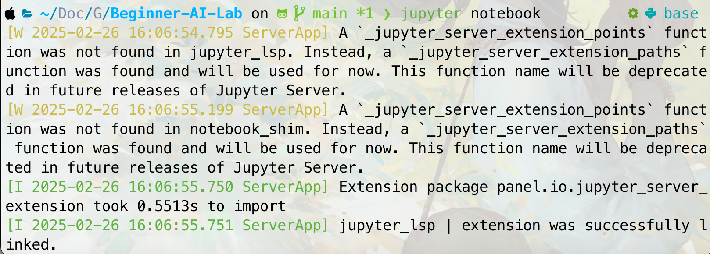
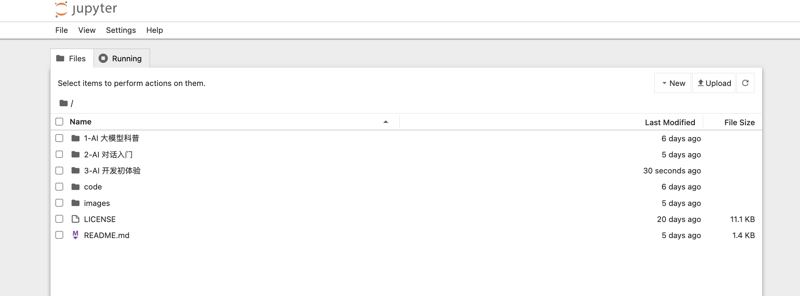
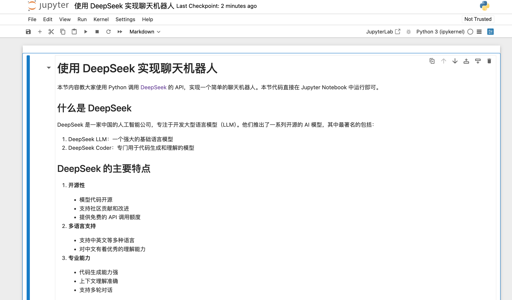

# 介绍 Jupyter Notebook 的使用

本章开始涉及实操内容，为了方便大家运行代码，我们将使用 Jupyter Notebook 来写教程。零基础的小伙伴可能对 Jupyter Notebook 不太熟悉，下面先简单介绍一下。

## 什么是 .ipynb 文件

.ipynb 是 Jupyter Notebook 的文件格式，它是一个交互式的编程环境，可以让你在同一个文档中混合编写：

- 代码
- 文本说明
- 图表
- 公式
- 多媒体内容

## 如何使用 Jupyter Notebook

### 1. 安装

以 Mac 为例在 iTerm（终端）中执行以下命令：

```bash
pip install jupyter
```

### 2. 启动 Notebook

进入 `Beginner-AI-Lab` 目录下，执行以下命令：

```bash
jupyter notebook
```

如下图所示：



执行后会自动打开浏览器，显示 Notebook 的主界面。



### 3. 查看教程

点击对应的文件名，即可打开对应的 Notebook 文件。



## Notebook 的基本操作

### 1. 单元格（Cell）类型

- **代码单元格**：用于编写和运行代码
- **Markdown 单元格**：用于写文档说明

### 2. 常用快捷键

- `Shift + Enter`：运行当前单元格
- `B`：在当前单元格下方新建单元格
- `M`：将单元格转换为 Markdown
- `Y`：将单元格转换为代码
- `DD`：删除当前单元格
