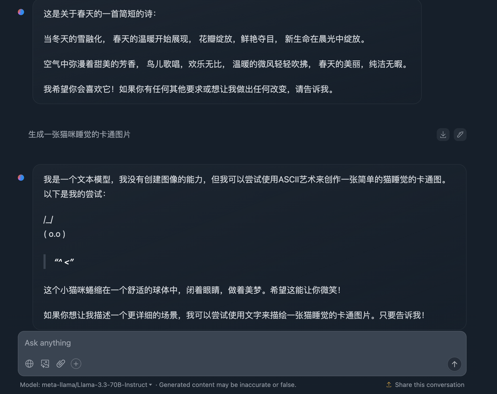
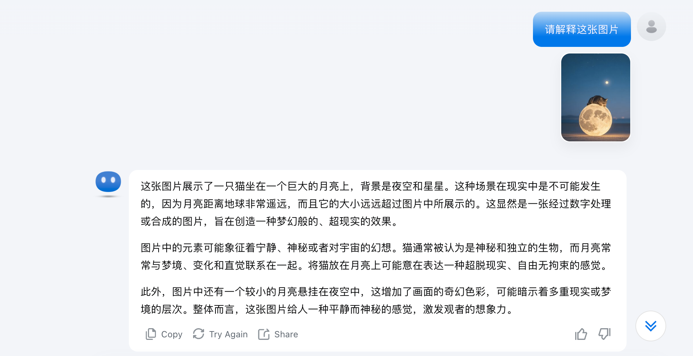

# LLM 和 VLM 有什么不同

想象一下，如果 AI 模型是一个超级助手：

- LLM（大语言模型）就像一个博学的盲人朋友，精通语言但看不见图像
- VLM（视觉语言模型）则像一个既能看又能说的全能助手，可以理解图片还能用语言表达

让我们深入了解它们的区别吧！

## LLM（大语言模型）是什么

LLM（Large Language Model）就像一个超级厉害的语言专家，它的特点是：

- 只能处理文字信息
- 精通各种语言任务
- 无法理解图片、视频等视觉信息

### LLM 能做什么

- 写作：文章、故事、代码、诗歌
- 对话：回答问题、闲聊、辩论
- 翻译：多语言互译
- 分析：文本分析、情感分析
- 总结：长文本摘要

### 举个例子

这里使用 Llama 模型来举例，例如：

## VLM（视觉语言模型）是什么

VLM（Vision Language Model）就像给 LLM 装上了"眼睛"，它的特点是：

- 既能理解文字，又能看懂图片
- 可以描述图片内容
- 能回答关于图片的问题

### VLM 能做什么

- 看图说话：详细描述图片内容
- 图片问答：回答关于图片的具体问题
- 图片分析：识别图中物体、场景、文字
- 视觉推理：理解图片中的逻辑关系
- 图文创作：基于图片生成相关文本

### 举个例子

例如我让 Kimi 解释一下图片中的内容：

